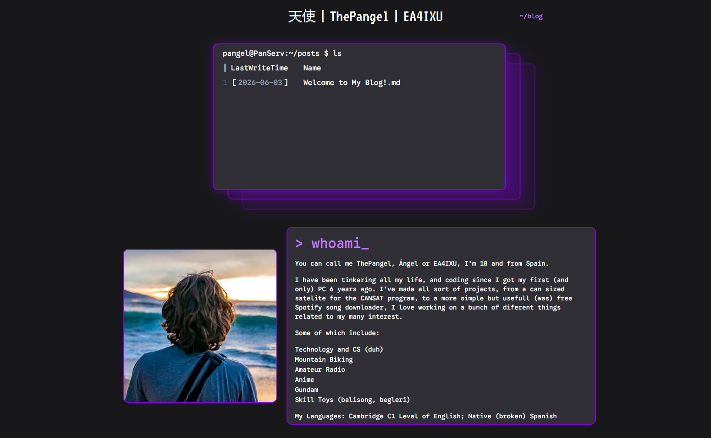
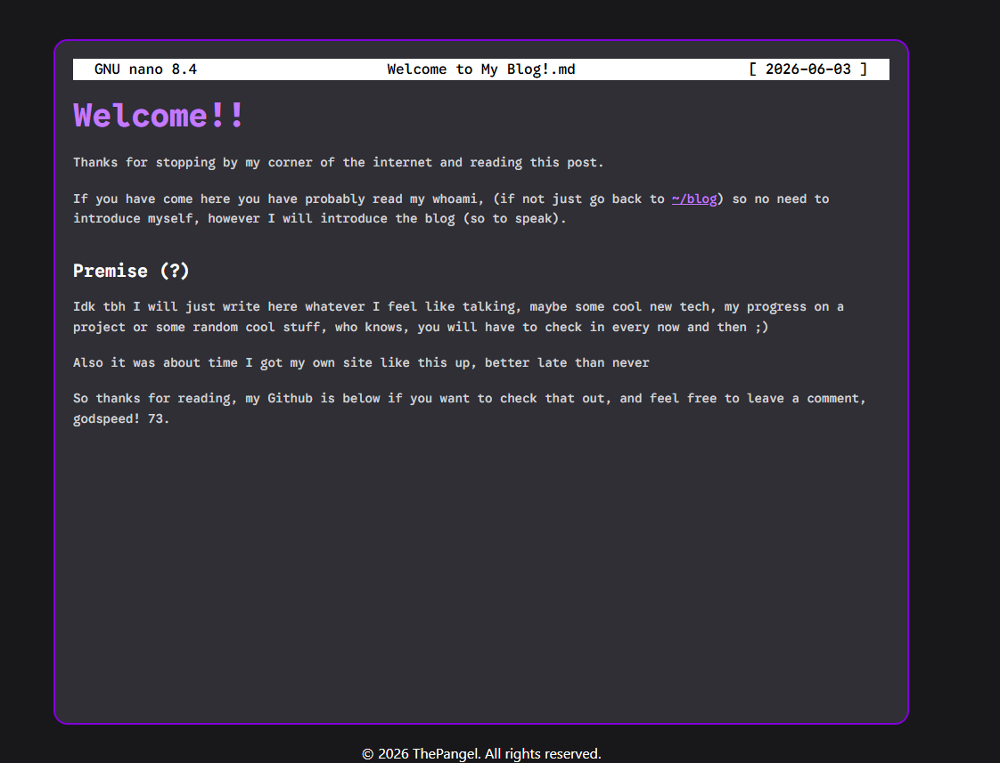

# ThePangels stuff blog

Just my own blog page so I can post stuff about whatever, feel free to have a read at [thepangel.github.io](https://thepangel.github.io)


# How it works

This site uses Hugo, a static site generator, this makes this site easy to host, like for example in GH Pages.

I write my post in markdown, then when I run ``hugo``, hugo generates and parses the markdown files and generates static html files for the website.

 
# Usage

To create a new post run:
```bash
hugo new content ./path
```
When you have finished writing, set ``draft: false`` and run ``hugo`` to generate the updated static site

# Deployment

use 
```bash
hugo deploy
```
to deploy to a connected service like AWS.

To host through github pages like I do myself just install the Hugo GH Action and push the project files (always verify everything seems correct locally before pushing) and enable GH pages
# Looks

I used my favorite color, purple, and dark gray for the site colors. (my second favorite color, black, was to harsh so I opted for this lighter shade).

It's pretty overused but I themed it after a linux terminal, using the ``ls`` command to show the available post, then it looks like you opened the file in GNU Nano, which I use a lot to read simple text files myself.

I also opted to do this like floating hologram effect that looks really cool but was tough to nail.

On the top It shows my name in Japanese, my nick, and my HAM callsign, so my name in a bunch of ways

The main page has also a whomai text, where I introduce myself



# Comments and reactions

The individual post use [giscus](https://giscus.app/) at the end for comments and reactions.

Giscus uses GitHub discussions, so you dont have to build your own infrastructure or host any backend or database, it also prevents spam since you have to sign in with GH to comment or react.

This enables anyonw to leave their thoughts, criticism or feedback on my post, and I think that's great.


